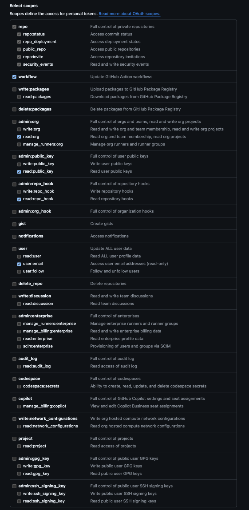

# Organization Summary Script

## Usage

This script retrieves organization information using the GitHub GraphQL API.

### Required Arguments

- `organization`: The name of the GitHub organization to query

### Prerequisites

- A GitHub Personal Access Token (PAT) with admin access is required
- The PAT must be set as an environment variable or provided securely to the script
- Node.js is required to run the script

### Command Line Options

The script supports the following command line options:

- `<organization>`: (required) The name of the GitHub organization to query.
- `--skip-archive`: (optional) Exclude archived repositories from the output.
- `--skip-fork`: (optional) Exclude forked repositories from the output.
- `--org-members`: (optional) Fetch organization members and save to a file.

#### Usage

```bash
node org_summary.js <organization> [--skip-archive] [--skip-fork]
```

### Example

```bash
npm install
mkdir data
node org_summary.js <organization-name> --skip-archive --skip-fork
```

Note: The script requires administrative access to the organization to successfully retrieve all data.

### GitHub Classic Token Configuration

To use this script, you need a GitHub Personal Access Token (classic) with appropriate permissions. Below is an example of how to configure your classic token:



- Go to your GitHub account settings > Developer settings > Personal access tokens > Tokens (classic)
- Generate a new token with the required scopes shown in the image above
- Save the token securely and set it as an environment variable or provide it securely to the script.